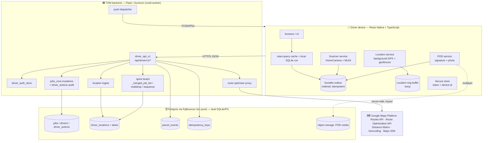
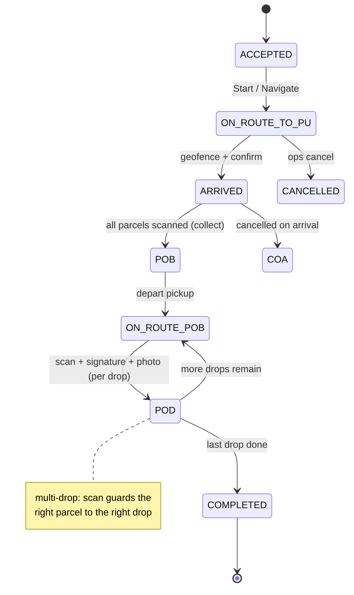
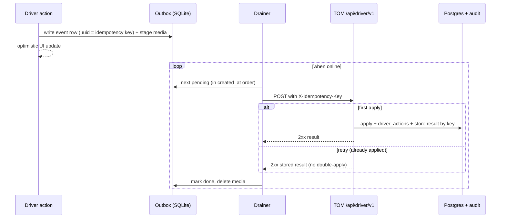
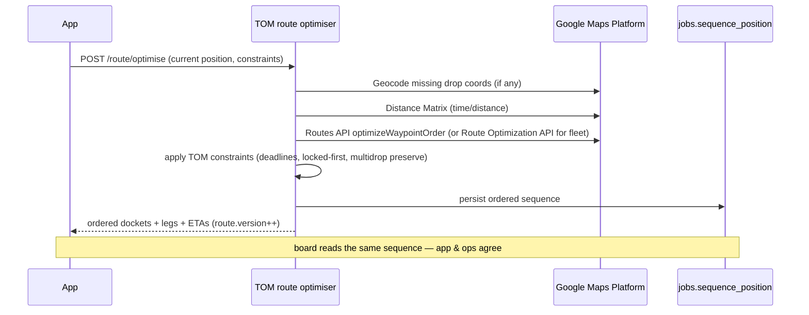

# Diagrams — TOM Driver App

Mermaid sources. Render in any Mermaid-capable viewer (GitHub, VS Code, mermaid.live).

---

## 1. System topology

## 2. Job lifecycle (status machine)

## 3. Offline write path (durable, idempotent)

## 4. Route optimisation flow

